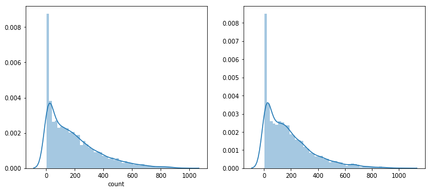

.. code:: ipython3

    import pylab
    import calendar
    import numpy as np
    import pandas as pd
    import seaborn as sn
    from scipy import stats
    from datetime import datetime
    import matplotlib.pyplot as plt
    import warnings
    pd.options.mode.chained_assignment = None
    warnings.filterwarnings("ignore", category=DeprecationWarning)
    %matplotlib inline

.. code:: ipython3

    import missingno as msno

.. code:: ipython3

    # Lets Read In The Dataset
    dailyData = pd.read_csv("F:/Machine Learning Project/Dataset/B/train.csv")

.. code:: ipython3

    # Data Summary
    # Shape Of The Dataset
    dailyData.shape

.. parsed-literal::

    (10886, 12)

.. code:: ipython3

    # Sample Of First Few Rows
    dailyData.head(2)
    

.. raw:: html

    

    
    <table border="1" class="dataframe">
      <thead>
        <tr style="text-align: right;">
          <th></th>
          <th>datetime</th>
          <th>season</th>
          <th>holiday</th>
          <th>workingday</th>
          <th>weather</th>
          <th>temp</th>
          <th>atemp</th>
          <th>humidity</th>
          <th>windspeed</th>
          <th>casual</th>
          <th>registered</th>
          <th>count</th>
        </tr>
      </thead>
      <tbody>
        <tr>
          <th>0</th>
          <td>2011-01-01 00:00:00</td>
          <td>1</td>
          <td>0</td>
          <td>0</td>
          <td>1</td>
          <td>9.84</td>
          <td>14.395</td>
          <td>81</td>
          <td>0.0</td>
          <td>3</td>
          <td>13</td>
          <td>16</td>
        </tr>
        <tr>
          <th>1</th>
          <td>2011-01-01 01:00:00</td>
          <td>1</td>
          <td>0</td>
          <td>0</td>
          <td>1</td>
          <td>9.02</td>
          <td>13.635</td>
          <td>80</td>
          <td>0.0</td>
          <td>8</td>
          <td>32</td>
          <td>40</td>
        </tr>
      </tbody>
    </table>
    

.. code:: ipython3

    dailyData.dtypes
    

.. parsed-literal::

    datetime       object
    season          int64
    holiday         int64
    workingday      int64
    weather         int64
    temp          float64
    atemp         float64
    humidity        int64
    windspeed     float64
    casual          int64
    registered      int64
    count           int64
    dtype: object

.. code:: ipython3

    # Creating New Columns From "Datetime" Column
    dailyData["date"] = dailyData.datetime.apply(lambda x : x.split()[0])
    dailyData["hour"] = dailyData.datetime.apply(lambda x : x.split()[1].split(":")[0])
    dailyData["weekday"] = dailyData.date.apply(lambda dateString : calendar.day_name[datetime.strptime(dateString,"%Y-%m-%d").weekday()])
    dailyData["month"] = dailyData.date.apply(lambda dateString : calendar.month_name[datetime.strptime(dateString,"%Y-%m-%d").month])
    dailyData["season"] = dailyData.season.map({1: "Spring", 2 : "Summer", 3 : "Fall", 4 :"Winter" })
    dailyData["weather"] = dailyData.weather.map({1: " Clear + Few clouds + Partly cloudy + Partly cloudy",\
                                            2 : " Mist + Cloudy, Mist + Broken clouds, Mist + Few clouds, Mist ", \
                                            3 : " Light Snow, Light Rain + Thunderstorm + Scattered clouds, Light Rain + Scattered clouds", \
                                            4 :" Heavy Rain + Ice Pallets + Thunderstorm + Mist, Snow + Fog " })
    

.. code:: ipython3

    # Coercing To Category Type
    categoryVariableList = ["hour","weekday","month","season","weather","holiday","workingday"]
    for var in categoryVariableList:
        dailyData[var] = dailyData[var].astype("category")

.. code:: ipython3

    # Dropping Unncessary Columns
    dailyData  = dailyData.drop(["datetime"],axis=1)
    

.. code:: ipython3

    # Lets Start With Very Simple Visualization Of Variables DataType Count
    dataTypeDf = pd.DataFrame(dailyData.dtypes.value_counts()).reset_index().rename(columns={"index":"variableType",0:"count"})
    fig,ax = plt.subplots()
    fig.set_size_inches(12,5)
    sn.barplot(data=dataTypeDf,x="variableType",y="count",ax=ax)
    ax.set(xlabel='variableTypeariable Type', ylabel='Count',title="Variables DataType Count")

.. parsed-literal::

    [Text(0,0.5,'Count'),
     Text(0.5,0,'variableTypeariable Type'),
     Text(0.5,1,'Variables DataType Count')]

.. code:: ipython3

    # Skewness In Distribution
    msno.matrix(dailyData,figsize=(12,5))
    

.. parsed-literal::

    <matplotlib.axes._subplots.AxesSubplot at 0xb739a48e10>

.. code:: ipython3

    # Outliers Analysis
    fig, axes = plt.subplots(nrows=2,ncols=2)
    fig.set_size_inches(12, 10)
    sn.boxplot(data=dailyData,y="count",orient="v",ax=axes[0][0])
    sn.boxplot(data=dailyData,y="count",x="season",orient="v",ax=axes[0][1])
    sn.boxplot(data=dailyData,y="count",x="hour",orient="v",ax=axes[1][0])
    sn.boxplot(data=dailyData,y="count",x="workingday",orient="v",ax=axes[1][1])
    
    axes[0][0].set(ylabel='Count',title="Box Plot On Count")
    axes[0][1].set(xlabel='Season', ylabel='Count',title="Box Plot On Count Across Season")
    axes[1][0].set(xlabel='Hour Of The Day', ylabel='Count',title="Box Plot On Count Across Hour Of The Day")
    axes[1][1].set(xlabel='Working Day', ylabel='Count',title="Box Plot On Count Across Working Day")

.. parsed-literal::

    [Text(0,0.5,'Count'),
     Text(0.5,0,'Working Day'),
     Text(0.5,1,'Box Plot On Count Across Working Day')]

.. code:: ipython3

    # Lets Remove Outliers In The Count Column
    dailyDataWithoutOutliers = dailyData[np.abs(dailyData["count"]-dailyData["count"].mean())<=(3*dailyData["count"].std())] 

.. code:: ipython3

    # Correlation Analysis
    corrMatt = dailyData[["temp","atemp","casual","registered","humidity","windspeed","count"]].corr()
    mask = np.array(corrMatt)
    mask[np.tril_indices_from(mask)] = False
    fig,ax= plt.subplots()
    fig.set_size_inches(20,10)
    sn.heatmap(corrMatt, mask=mask,vmax=.8, square=True,annot=True)

.. parsed-literal::

    <matplotlib.axes._subplots.AxesSubplot at 0xb73a6204e0>

.. code:: ipython3

    fig,(ax1,ax2,ax3) = plt.subplots(ncols=3)
    fig.set_size_inches(12, 5)
    sn.regplot(x="temp", y="count", data=dailyData,ax=ax1)
    sn.regplot(x="windspeed", y="count", data=dailyData,ax=ax2)
    sn.regplot(x="humidity", y="count", data=dailyData,ax=ax3)

.. parsed-literal::

    <matplotlib.axes._subplots.AxesSubplot at 0xb73b13b278>

.. code:: ipython3

    # Visualizing Distribution Of Data
    fig,axes = plt.subplots(ncols=2,nrows=2)
    fig.set_size_inches(12, 10)
    sn.distplot(dailyData["count"],ax=axes[0][0])
    stats.probplot(dailyData["count"], dist='norm', fit=True, plot=axes[0][1])
    sn.distplot(np.log(dailyDataWithoutOutliers["count"]),ax=axes[1][0])
    stats.probplot(np.log1p(dailyDataWithoutOutliers["count"]), dist='norm', fit=True, plot=axes[1][1])

.. parsed-literal::

    C:\Users\Lenovo\Anaconda3\lib\site-packages\matplotlib\axes\_axes.py:6462: UserWarning: The 'normed' kwarg is deprecated, and has been replaced by the 'density' kwarg.
      warnings.warn("The 'normed' kwarg is deprecated, and has been "
    C:\Users\Lenovo\Anaconda3\lib\site-packages\matplotlib\axes\_axes.py:6462: UserWarning: The 'normed' kwarg is deprecated, and has been replaced by the 'density' kwarg.
      warnings.warn("The 'normed' kwarg is deprecated, and has been "
    

.. parsed-literal::

    ((array([-3.82819677, -3.60401975, -3.48099008, ...,  3.48099008,
              3.60401975,  3.82819677]),
      array([0.69314718, 0.69314718, 0.69314718, ..., 6.5971457 , 6.59850903,
             6.5998705 ])),
     (1.3486990121229776, 4.562423868087808, 0.9581176780909612))

.. code:: ipython3

    # Visualizing Count Vs (Month,Season,Hour,Weekday,Usertype)
    fig,(ax1,ax2,ax3,ax4)= plt.subplots(nrows=4)
    fig.set_size_inches(12,20)
    sortOrder = ["January","February","March","April","May","June","July","August","September","October","November","December"]
    hueOrder = ["Sunday","Monday","Tuesday","Wednesday","Thursday","Friday","Saturday"]
    
    monthAggregated = pd.DataFrame(dailyData.groupby("month")["count"].mean()).reset_index()
    monthSorted = monthAggregated.sort_values(by="count",ascending=False)
    sn.barplot(data=monthSorted,x="month",y="count",ax=ax1,order=sortOrder)
    ax1.set(xlabel='Month', ylabel='Avearage Count',title="Average Count By Month")
    
    hourAggregated = pd.DataFrame(dailyData.groupby(["hour","season"],sort=True)["count"].mean()).reset_index()
    sn.pointplot(x=hourAggregated["hour"], y=hourAggregated["count"],hue=hourAggregated["season"], data=hourAggregated, join=True,ax=ax2)
    ax2.set(xlabel='Hour Of The Day', ylabel='Users Count',title="Average Users Count By Hour Of The Day Across Season",label='big')
    
    hourAggregated = pd.DataFrame(dailyData.groupby(["hour","weekday"],sort=True)["count"].mean()).reset_index()
    sn.pointplot(x=hourAggregated["hour"], y=hourAggregated["count"],hue=hourAggregated["weekday"],hue_order=hueOrder, data=hourAggregated, join=True,ax=ax3)
    ax3.set(xlabel='Hour Of The Day', ylabel='Users Count',title="Average Users Count By Hour Of The Day Across Weekdays",label='big')
    
    hourTransformed = pd.melt(dailyData[["hour","casual","registered"]], id_vars=['hour'], value_vars=['casual', 'registered'])
    hourAggregated = pd.DataFrame(hourTransformed.groupby(["hour","variable"],sort=True)["value"].mean()).reset_index()
    sn.pointplot(x=hourAggregated["hour"], y=hourAggregated["value"],hue=hourAggregated["variable"],hue_order=["casual","registered"], data=hourAggregated, join=True,ax=ax4)
    ax4.set(xlabel='Hour Of The Day', ylabel='Users Count',title="Average Users Count By Hour Of The Day Across User Type",label='big')

.. parsed-literal::

    [Text(0,0.5,'Users Count'),
     Text(0.5,0,'Hour Of The Day'),
     Text(0.5,1,'Average Users Count By Hour Of The Day Across User Type'),
     None]

.. code:: ipython3

    # Lets Read In Train And Test Data
    dataTrain = pd.read_csv("F:/Machine Learning Project/Dataset/B/train.csv")
    dataTest = pd.read_csv("F:/Machine Learning Project/Dataset/B/test.csv")

.. code:: ipython3

    # Combine Train And Test
    data = dataTrain.append(dataTest)
    data.reset_index(inplace=True)
    data.drop('index',inplace=True,axis=1)

.. parsed-literal::

    C:\Users\Lenovo\Anaconda3\lib\site-packages\pandas\core\frame.py:6201: FutureWarning: Sorting because non-concatenation axis is not aligned. A future version
    of pandas will change to not sort by default.
    
    To accept the future behavior, pass 'sort=True'.
    
    To retain the current behavior and silence the warning, pass sort=False
    
      sort=sort)
    

.. code:: ipython3

    # Feature Engineering
    data["date"] = data.datetime.apply(lambda x : x.split()[0])
    data["hour"] = data.datetime.apply(lambda x : x.split()[1].split(":")[0]).astype("int")
    data["year"] = data.datetime.apply(lambda x : x.split()[0].split("-")[0])
    data["weekday"] = data.date.apply(lambda dateString : datetime.strptime(dateString,"%Y-%m-%d").weekday())
    data["month"] = data.date.apply(lambda dateString : datetime.strptime(dateString,"%Y-%m-%d").month)

.. code:: ipython3

    # Random Forest Model To Predict 0's In Windspeed
    from sklearn.ensemble import RandomForestRegressor
    
    dataWind0 = data[data["windspeed"]==0]
    dataWindNot0 = data[data["windspeed"]!=0]
    rfModel_wind = RandomForestRegressor()
    windColumns = ["season","weather","humidity","month","temp","year","atemp"]
    rfModel_wind.fit(dataWindNot0[windColumns], dataWindNot0["windspeed"])
    
    wind0Values = rfModel_wind.predict(X= dataWind0[windColumns])
    dataWind0["windspeed"] = wind0Values
    data = dataWindNot0.append(dataWind0)
    data.reset_index(inplace=True)
    data.drop('index',inplace=True,axis=1)

.. code:: ipython3

    # Coercing To Categorical Type
    categoricalFeatureNames = ["season","holiday","workingday","weather","weekday","month","year","hour"]
    numericalFeatureNames = ["temp","humidity","windspeed","atemp"]
    dropFeatures = ['casual',"count","datetime","date","registered"]

.. code:: ipython3

    for var in categoricalFeatureNames:
        data[var] = data[var].astype("category")

.. code:: ipython3

    # Splitting Train And Test Data
    dataTrain = data[pd.notnull(data['count'])].sort_values(by=["datetime"])
    dataTest = data[~pd.notnull(data['count'])].sort_values(by=["datetime"])
    datetimecol = dataTest["datetime"]
    yLabels = dataTrain["count"]
    yLablesRegistered = dataTrain["registered"]
    yLablesCasual = dataTrain["casual"]

.. code:: ipython3

    # Dropping Unncessary Variables
    dataTrain  = dataTrain.drop(dropFeatures,axis=1)
    dataTest  = dataTest.drop(dropFeatures,axis=1)

.. code:: ipython3

    # RMSLE Scorer
    def rmsle(y, y_,convertExp=True):
        if convertExp:
            y = np.exp(y),
            y_ = np.exp(y_)
        log1 = np.nan_to_num(np.array([np.log(v + 1) for v in y]))
        log2 = np.nan_to_num(np.array([np.log(v + 1) for v in y_]))
        calc = (log1 - log2) ** 2
        return np.sqrt(np.mean(calc))

.. code:: ipython3

    # Linear Regression Model
    from sklearn.linear_model import LinearRegression,Ridge,Lasso
    from sklearn.model_selection import GridSearchCV
    from sklearn import metrics
    import warnings
    pd.options.mode.chained_assignment = None
    warnings.filterwarnings("ignore", category=DeprecationWarning)
    
    # Initialize logistic regression model
    lModel = LinearRegression()
    
    # Train the model
    yLabelsLog = np.log1p(yLabels)
    lModel.fit(X = dataTrain,y = yLabelsLog)
    
    # Make predictions
    preds = lModel.predict(X= dataTrain)
    print ("RMSLE Value For Linear Regression: ",rmsle(np.exp(yLabelsLog),np.exp(preds),False))

.. parsed-literal::

    RMSLE Value For Linear Regression:  0.9779166619802158
    

.. code:: ipython3

    # Regularization Model - Ridge
    ridge_m_ = Ridge()
    ridge_params_ = { 'max_iter':[3000],'alpha':[0.1, 1, 2, 3, 4, 10, 30,100,200,300,400,800,900,1000]}
    rmsle_scorer = metrics.make_scorer(rmsle, greater_is_better=False)
    grid_ridge_m = GridSearchCV( ridge_m_,
                              ridge_params_,
                              scoring = rmsle_scorer,
                              cv=5)
    yLabelsLog = np.log1p(yLabels)
    grid_ridge_m.fit( dataTrain, yLabelsLog )
    preds = grid_ridge_m.predict(X= dataTrain)
    print (grid_ridge_m.best_params_)
    print ("RMSLE Value For Ridge Regression: ",rmsle(np.exp(yLabelsLog),np.exp(preds),False))
    
    fig,ax= plt.subplots()
    fig.set_size_inches(12,5)
    df = pd.DataFrame(grid_ridge_m.grid_scores_)
    df["alpha"] = df["parameters"].apply(lambda x:x["alpha"])
    df["rmsle"] = df["mean_validation_score"].apply(lambda x:-x)
    sn.pointplot(data=df,x="alpha",y="rmsle",ax=ax)

.. parsed-literal::

    {'alpha': 0.1, 'max_iter': 3000}
    RMSLE Value For Ridge Regression:  0.9779166468751135
    

.. parsed-literal::

    <matplotlib.axes._subplots.AxesSubplot at 0xb73e774400>

.. code:: ipython3

    # Regularization Model - Lasso
    lasso_m_ = Lasso()
    
    alpha  = 1/np.array([0.1, 1, 2, 3, 4, 10, 30,100,200,300,400,800,900,1000])
    lasso_params_ = { 'max_iter':[3000],'alpha':alpha}
    
    grid_lasso_m = GridSearchCV( lasso_m_,lasso_params_,scoring = rmsle_scorer,cv=5)
    yLabelsLog = np.log1p(yLabels)
    grid_lasso_m.fit( dataTrain, yLabelsLog )
    preds = grid_lasso_m.predict(X= dataTrain)
    print (grid_lasso_m.best_params_)
    print ("RMSLE Value For Lasso Regression: ",rmsle(np.exp(yLabelsLog),np.exp(preds),False))
    
    fig,ax= plt.subplots()
    fig.set_size_inches(12,5)
    df = pd.DataFrame(grid_lasso_m.grid_scores_)
    df["alpha"] = df["parameters"].apply(lambda x:x["alpha"])
    df["rmsle"] = df["mean_validation_score"].apply(lambda x:-x)
    sn.pointplot(data=df,x="alpha",y="rmsle",ax=ax)

.. parsed-literal::

    {'alpha': 0.005, 'max_iter': 3000}
    RMSLE Value For Lasso Regression:  0.9780553460751863
    

.. parsed-literal::

    <matplotlib.axes._subplots.AxesSubplot at 0xb73e7eca20>

.. code:: ipython3

    # Ensemble Models - Random Forest
    from sklearn.ensemble import RandomForestRegressor
    rfModel = RandomForestRegressor(n_estimators=100)
    yLabelsLog = np.log1p(yLabels)
    rfModel.fit(dataTrain,yLabelsLog)
    preds = rfModel.predict(X= dataTrain)
    print ("RMSLE Value For Random Forest: ",rmsle(np.exp(yLabelsLog),np.exp(preds),False))

.. parsed-literal::

    RMSLE Value For Random Forest:  0.10327753936760387
    

.. code:: ipython3

    # Ensemble Model - Gradient Boost
    from sklearn.ensemble import GradientBoostingRegressor
    gbm = GradientBoostingRegressor(n_estimators=4000,alpha=0.01); ### Test 0.41
    yLabelsLog = np.log1p(yLabels)
    gbm.fit(dataTrain,yLabelsLog)
    preds = gbm.predict(X= dataTrain)
    print ("RMSLE Value For Gradient Boost: ",rmsle(np.exp(yLabelsLog),np.exp(preds),False))

.. parsed-literal::

    RMSLE Value For Gradient Boost:  0.18974224270228143
    

.. code:: ipython3

    predsTest = gbm.predict(X= dataTest)
    fig,(ax1,ax2)= plt.subplots(ncols=2)
    fig.set_size_inches(12,5)
    sn.distplot(yLabels,ax=ax1,bins=50)
    sn.distplot(np.exp(predsTest),ax=ax2,bins=50)

.. parsed-literal::

    C:\Users\Lenovo\Anaconda3\lib\site-packages\matplotlib\axes\_axes.py:6462: UserWarning: The 'normed' kwarg is deprecated, and has been replaced by the 'density' kwarg.
      warnings.warn("The 'normed' kwarg is deprecated, and has been "
    C:\Users\Lenovo\Anaconda3\lib\site-packages\matplotlib\axes\_axes.py:6462: UserWarning: The 'normed' kwarg is deprecated, and has been replaced by the 'density' kwarg.
      warnings.warn("The 'normed' kwarg is deprecated, and has been "
    

.. parsed-literal::

    <matplotlib.axes._subplots.AxesSubplot at 0xb73f9de208>

.. code:: ipython3

    submission = pd.DataFrame({
            "datetime": datetimecol,
            "count": [max(0, x) for x in np.exp(predsTest)]
        })
    submission.to_csv('bike_predictions_gbm_separate_without_fe.csv', index=False)
